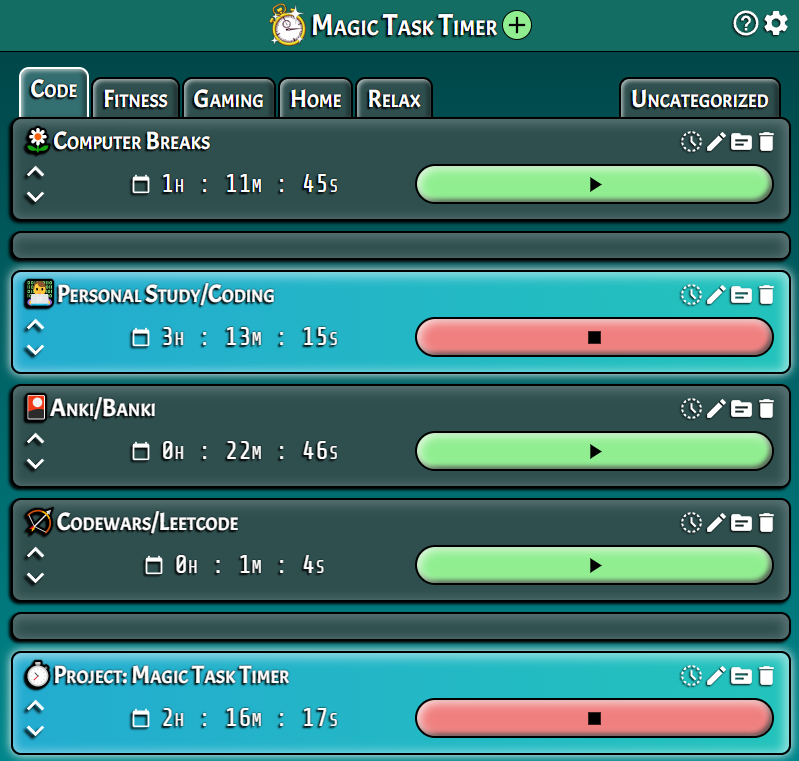

# things learned:
CSSVariables: Used CSS variables and conditional classes in React/JSX to allow user to theme the app to their preference.

became comfortable with props

extensive use of useState and useEffect hooks

LOTS of practice with conditional rendering and conditional animations

## Magic Task Timer

**"Take control of how you spend your time be becoming aware of how you use it."** -Adam Morsa, Software Engineer

**Magic Task Timer** is a timeclock for your life.

Track the time you spend each day on projects, tasks, freelancing, getting fit, needlework, chores, socializing, breakdancing, dragon slaying- whatever you want.

**Link to project:** [https://task-magic.netlify.app/](https://task-magic.netlify.app/)

---

## How It's Made
**Tech used:** React, React-Icons, JSX, HTML, CSS, JavaScript

I've been wanting to building an app like this since I first started studying web development- a simple-to-use, visually pleasing way to track the amount of time I spend on various projects each day, with the ability to easily view the history of my time spent on each project over time.

When I started learning React, I realized it was the perfect 'framework' with which to build this app. With only a few short video tutorials under my belt, I decided to dive in and start building, figuring I'd pick the rest up on the way.

In order to build a strong foundation for understanding React-ful thinking, I built each component from scratch, hand-coding every line of JavaScript and CSS.

As the project grew I became comfortable with the concept of state and React hooks, making extensive use of <code>useState</code> and <code>useEffect</code> throughout.

I am particularly proud of building the task history heatmaps and the theming system from scratch.

### Features

| *Feature*||
|---|---|
| **Search** | Users are able to search for a specific term |
| **Filter** | Users are able to filter selected subreddit by trending values |
| **Select Subreddit**| Users are able to update post list be selecting from one of the popular subreddits listed aside, or by selecting the subreddit in the post's header |
| **Show NSFW/Spoilers** | Users are able to toggle the view nsfw and spoiler content.   Content is defaulted hidden |
| **Shorten Text Posts** | Users are able to toggle the body of any post with text to shorten the length displayed |
| **View Comments** | Users are able to view comments, but not make any |

---

## Optimizations
*(optional)*

You don't have to include this section but interviewers *love* that you can not only deliver a final product that looks great but also functions efficiently. Did you write something then refactor it later and the result was 5x faster than the original implementation? Did you cache your assets? Things that you write in this section are **GREAT** to bring up in interviews and you can use this section as reference when studying for technical interviews!

## Lessons Learned:

No matter what your experience level, being an engineer means continuously learning. Every time you build something you always have those *whoa this is awesome* or *fuck yeah I did it!* moments. This is where you should share those moments! Recruiters and interviewers love to see that you're self-aware and passionate about growing.

## Examples:
Take a look at these couple examples that I have in my own portfolio:

**Palettable:** https://github.com/alecortega/palettable

**Twitter Battle:** https://github.com/alecortega/twitter-battle

---

## Run Locally

This project was bootstrapped with [Create React App](https://github.com/facebook/create-react-app).

## Available Scripts

In the project directory, you can run:

### `npm start`

> Runs the app in the development mode.  
> Open [http://localhost:3000](http://localhost:3000) to view it in the browser.  
> The page will reload if you make edits.  
> You will also see any lint errors in the console.

### `npm test`

> Launches the test runner in the interactive watch mode.  
> See the section about [running tests](https://facebook.github.io/create-react-app/docs/running-tests) for more information.

### `npm run build`

> Builds the app for production, minifying the code and optimizing it for the best performance.
> Exports production version to the `build` folder.  
